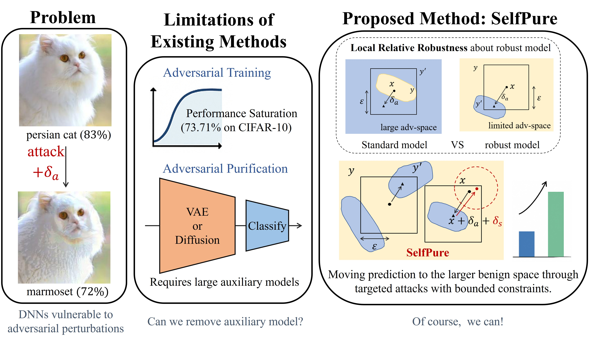

# Self-Purification: Enhancing Adversarial Defense by Leveraging Local Relative Robustness

<p align="center">
  
</p>

## Overview

This repository contains the official implementation of **SelfPure**, a no-auxiliary-model adversarial purification method for robustly trained models. SelfPure leverages the **local relative robustness** property of adversarially trained models — their inherently limited adversarial space — to purify adversarial examples through targeted attacks with bounded constraints, eliminating the need for large auxiliary models like VAEs or Diffusion models.

### Key Insight

- **Adversarial Training** suffers from performance saturation (e.g., 73.71% on CIFAR-10 under AutoAttack).
- **Existing Adversarial Purification** methods require large auxiliary models (VAE/Diffusion) for reconstruction.
- **SelfPure** exploits the fact that robust models have a much smaller adversarial space than standard models. By performing targeted attacks within this bounded space, the prediction naturally shifts to the benign region.

## Installation

```bash
git clone https://github.com/YourUsername/SelfPure.git
cd SelfPure
pip install -r requirements.txt
```

**Key Dependencies:**
- PyTorch >= 2.2.1
- RobustBench
- AutoAttack
- timm

## Project Structure

```
SelfPure/
├── SelfPure.py                     # Core purification algorithm
├── AutoattackforSelfPure.py        # AutoAttack evaluation with SelfPure
├── SelfPure_eval_for_robustbench.py  # Evaluation on RobustBench models (CIFAR)
├── SelfPure_eval_for_flower102.py    # Evaluation on Flower102
├── eval_AA_SelfPure.py             # Standalone AutoAttack + SelfPure evaluation
├── eval_target_cf10.py             # Targeted evaluation on CIFAR-10
├── eval_target_flower102.py        # Targeted evaluation on Flower102
├── plot.ipynb / plot2.ipynb        # Result visualization
├── core/
│   ├── attacks/                    # Attack implementations (PGD, APGD, FAB, Square, etc.)
│   ├── models/                     # Model architectures (ResNet, WideResNet, PreActResNet)
│   └── utils/                      # Training utilities, parsers, loggers
├── figure/                         # Result figures
├── requirements.txt
└── README.md
```

## Usage

### 1. Evaluate with RobustBench Models (CIFAR-10/100)

```bash
CUDA_VISIBLE_DEVICES=0 python SelfPure_eval_for_robustbench.py \
    --data 'cifar10' \
    --desc 'Debenedetti2022Light_XCiT-M12' \
    --prefix 'com-CF10-apgd' \
    --batch-size 50 \
    --gattack 'linf-apgd' \
    --gattack-loss 'dlr' \
    --gattack-iter 100
```

### 2. AutoAttack Evaluation with SelfPure

```bash
CUDA_VISIBLE_DEVICES=0 python eval_AA_SelfPure.py \
    --data 'cifar10' \
    --desc 'Debenedetti2022Light_XCiT-M12'
```

### 3. Targeted Evaluation on CIFAR-10

```bash
CUDA_VISIBLE_DEVICES=0 python eval_target_cf10.py \
    --data 'cifar10' \
    --desc 'Debenedetti2022Light_XCiT-M12' \
    --prefix 'target-cf10' \
    --batch-size 50 \
    --gattack 'linf-pgd' \
    --gattack-loss 'cw' \
    --gattack-iter 40 \
    --sattack-target
```

### 4. Evaluation on Flower102

```bash
CUDA_VISIBLE_DEVICES=0 python eval_target_flower102.py \
    --data-dir '/path/to/data/' \
    --log-dir '/path/to/log/' \
    --desc 'flower102xcit' \
    --prefix 'comxcit-flower102-pgd' \
    --batch-size 3 \
    --gattack 'linf-pgd' \
    --gattack-loss 'cw' \
    --gattack-iter 40 \
    --sattack-target
```

## Arguments

| Argument | Description | Default |
|---|---|---|
| `--data` | Dataset (`cifar10`, `cifar100`, `svhn`) | `cifar10` |
| `--desc` | RobustBench model name | Required |
| `--batch-size` | Batch size | `5` |
| `--gattack` | Attack for generating adversarial examples | `linf-pgd` |
| `--gattack-eps` | Epsilon for attack perturbation | `8/255` |
| `--gattack-iter` | Number of attack iterations | `40` |
| `--gattack-loss` | Loss function (`cw`, `ce`, `dlr`) | `cw` |
| `--sattack-target` | Enable targeted attack for purification | `False` |
| `--sattack-HN` | Enable HN regular for purification attack | `False` |
| `--prefix` | Output log prefix | `compare` |

## Supported Attacks

`fgsm`, `linf-pgd`, `l2-pgd`, `linf-apgd`, `l2-apgd`, `linf-fab`, `l2-fab`, `linf-square`, `l2-square`, `linf-df`, `l2-df`, `BPDA`

## Results

### CIFAR-10 under AutoAttack (Linf, eps=8/255)

See `figure/` for detailed visualizations of purification effectiveness across different robust models.

## Citation

If you find this work useful, please cite our paper:

```bibtex
@article{zhang2026self,
  title={Self-purification: Enhancing adversarial defense by leveraging local relative robustness},
  author={Zhang, Rui and Wicker, J{\"o}rg and Dost, Katharina and Yang, Qinli and Chen, Zeyu and Shao, Junming},
  journal={Expert Systems with Applications},
  pages={131703},
  year={2026},
  publisher={Elsevier}
}
```

## Acknowledgments

This project builds upon [RobustBench](https://github.com/RobustBench/robustbench), [AutoAttack](https://github.com/fra3z/autoattack), and [Advertorch](https://github.com/BorealisAI/advertorch).
